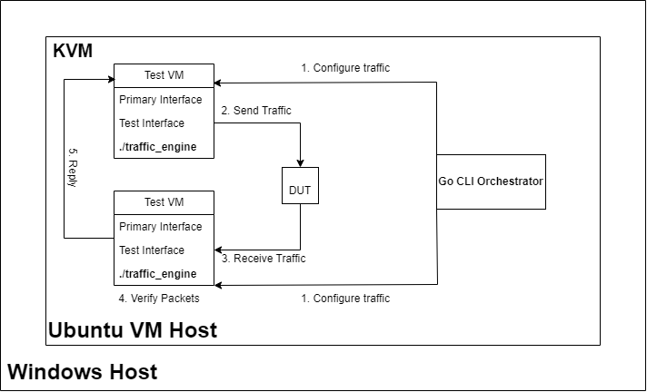

# Network Traffic Testing Framework, Master’s dissertation

A practical solution for automated network protocol testing across KVM virtual machines. Uses DPDK for high-performance packet processing and Go for orchestrating traffic between VMs.

## Overview

Network testing in virtualized environments is tricky. Most tools focus on performance but lack the control needed for testing specific protocols. This project solves that by providing a complete framework for generating, capturing, and analyzing traffic across multiple VMs.

## Solution Components

### 1. DPDK Traffic Engine (`DPDK/dpdk-app/`)
- **High-performance packet processing** using Intel DPDK
- **Multi-protocol support**: ICMP, UDP, TCP, DNS, ARP, Raw Ethernet
- **Traffic generation modes**: Continuous, Burst, Rate-limited, Exponential Backoff
- **Real-time statistics** with protocol-specific metrics
- **Modular architecture** with shared utilities and centralized configuration

### 2. VM Orchestrator (`vm-orchestrator/`)
- **Go-based CLI** for managing KVM virtual machines
- **SSH-based remote execution** for cross-VM coordination
- **Real-time statistics aggregation** from multiple VMs
- **Automated packet capture** with tcpdump integration
- **Graceful process management** with signal handling

### 3. Provisioning System (`provisioning/`)
- **Automated VM setup** with DPDK installation and configuration
- **Systemd services** for automatic DPDK interface binding
- **Network interface management** scripts for robust operation

## VM Network Architecture

Each VM has two network interfaces:
- **eth0 (Management)**: Connected to NAT bridge for SSH access and internet
- **eth1 (Test)**: Connected to `br-test` bridge, bound to DPDK for traffic testing

### DPDK Interface Binding

The test interface (eth1) is automatically bound to DPDK on VM boot:
1. **PCI device detection**: `ethtool -i eth1` extracts the PCI bus info (e.g., `0000:02:00.0`)
2. **Kernel driver unbinding**: Removes the interface from kernel control
3. **DPDK driver binding**: Binds to `uio_pci_generic` driver for DPDK access
4. **MAC address storage**: Saves the original MAC to `/etc/dpdk-env` for packet crafting

This allows the DPDK application to directly access the network hardware, bypassing the kernel networking stack for maximum performance.

## Architecture




## Motivation

Testing networks in VMs is harder than it looks. Tools like iperf are great for performance but don't give you the control needed to test specific protocols. This project was built to:

- Test how protocols behave across virtualized network stacks
- Automate complex scenarios involving multiple VMs
- Capture and analyze traffic at the packet level
- Generate realistic traffic patterns for stress testing

## DPDK Integration

This project uses Intel DPDK (Data Plane Development Kit) for packet processing. DPDK bypasses the kernel networking stack, giving direct access to network hardware for better performance.

**Why DPDK?**
- Kernel bypass eliminates overhead
- Poll-mode drivers use CPU more efficiently
- Huge pages reduce memory access latency
- NUMA awareness optimizes memory access

**Current Limitations:**
The hardware setup (laptop virtualization) doesn't allow true performance testing. We focus on functional testing - making sure protocols work correctly in virtualized environments.

## Key Features

### Protocol Support
- **ICMP**: Echo requests/replies with customizable parameters
- **UDP**: Datagram transmission with configurable messages
- **TCP**: Connection establishment and data transfer
- **DNS**: Query/response simulation with real domains
- **ARP**: Address resolution protocol testing
- **Raw Ethernet**: Low-level packet manipulation

### Traffic Generation Modes
- **Continuous**: Steady packet transmission with configurable intervals
- **Burst**: High-intensity short bursts with pause periods
- **Rate-limited**: Controlled transmission rates (packets per second)
- **Exponential Backoff**: Adaptive retry mechanisms with increasing delays
- **Random**: Automated protocol and mode selection for stress testing

### Orchestration Features
- Multi-VM coordination for RX/TX operations
- Real-time monitoring with live statistics aggregation
- Automated packet capture with timestamps and PCAP files
- Graceful shutdown and error handling with signal management
- SSH-based remote execution with robust connection handling
- Protocol-specific statistics (ICMP replies, TCP packets, UDP datagrams, DNS queries, ARP responses)
- Random message generation for UDP/TCP and domain selection for DNS
- Concurrent process management across multiple VMs

## Quick Start

### Prerequisites
- KVM virtualization support
- Go 1.16+ for orchestrator
- DPDK 21.11+ for traffic engine
- Two VMs with network interfaces

### Setup

**On each VM:**
```bash
# 1. Clone the repo
git clone <repo-url>
cd TestVM

# 2. Run provisioning script
cd provisioning
./provision.sh

# 3. Build the DPDK app
cd ../DPDK/dpdk-app
make
```

**On KVM host:**
```bash
# 1. Clone the repo
git clone <repo-url>
cd TestVM

# 2. Build the orchestrator
cd vm-orchestrator
go build -o vm-orchestrator

# 3. Run traffic test
./vm-orchestrator run-traffic --rx-vm testVM2 --tx-vm testVM1 --protocol icmp --mode continuous
```

### Example Usage
```bash
# Help
./vm-orchestrator help

# Basic ICMP test
./vm-orchestrator run-traffic --rx-vm testVM2 --tx-vm testVM1 --protocol icmp --mode continuous

# UDP with custom message
./vm-orchestrator run-traffic --rx-vm testVM2 --tx-vm testVM1 --protocol udp --mode burst --message "test"

# DNS query
./vm-orchestrator run-traffic --rx-vm testVM2 --tx-vm testVM1 --protocol dns --mode continuous --domain google.com

# Random traffic for stress testing
./vm-orchestrator run-traffic --rx-vm testVM2 --tx-vm testVM1 --protocol random --mode random
```

## Technical Implementation

### DPDK Application Architecture
```
src/
├── core/
│   ├── common.c/h      # Shared utilities and packet processing
│   ├── config.c/h      # Centralized configuration management
│   ├── log.c/h         # Structured logging system
│   ├── packet_utils.c/h # Packet parsing and validation
│   └── traffic_modes.c/h # Traffic generation algorithms
├── protocols/
│   ├── eth.c/h         # Raw Ethernet implementation
│   ├── icmp.c/h        # ICMP echo request/reply
│   ├── udp.c/h         # UDP datagram transmission
│   ├── tcp.c/h         # TCP connection handling
│   ├── arp.c/h         # ARP request/response
│   └── dns.c/h         # DNS query/response simulation
└── main/
    └── traffic_engine.c # Application entry point
```

### Go Orchestrator Design
```
cmd/
├── root.go             # Command registration and setup
├── vm.go              # VM lifecycle management
├── traffic.go          # Traffic orchestration logic
└── help.go            # User documentation
```

## Performance Considerations

The current setup focuses on functional testing rather than performance testing due to hardware limitations. But the architecture supports high-performance scenarios:

### Current Limitations
- Laptop virtualization limits CPU and memory
- Software networking without hardware offloads
- Single-threaded packet processing

### Performance Potential
With better hardware, the framework can achieve high throughput:
- PCI-PT (PCI Pass-Through) for direct hardware access
- SR-IOV for hardware virtualization
- Multi-core packet processing
- Hardware offloads (checksum, TSO, LRO)

## Future Enhancements

### Functional Testing Improvements
1. **Complex Test Scenarios**
   - Multi-protocol simultaneous testing
   - Protocol state machine validation
   - Error condition simulation
   - Network topology testing

2. **PCAP Playback System**
   - Record real traffic patterns
   - Replay captured traffic for regression testing
   - Modify packet contents during replay
   - Validate responses against expected patterns

3. **Test Automation Framework**
   - YAML-based test configuration
   - Automated test result analysis
   - Integration with CI/CD pipelines
   - Test report generation

4. **Advanced Topologies**
   - Device Under Test (DUT) placement between VMs
   - Back-to-back traffic testing within single VM
   - Multiple test interfaces per VM
   - Network function virtualization (NFV) testing

### Performance Testing Capabilities
1. **Hardware Optimization**
   - PCI-PT implementation for direct hardware access
   - SR-IOV configuration for hardware virtualization
   - NUMA-aware memory allocation
   - Multi-queue support

2. **DPDK Optimizations**
   - Multi-core packet processing
   - Hardware offload configuration
   - Memory pool optimization
   - Poll-mode driver tuning

3. **Advanced Features**
   - Zero-copy packet processing
   - Hardware timestamping
   - Advanced statistics collection
        - Real-time performance monitoring

## Achievements

This project demonstrates several key skills and accomplishments:

### Technical Implementation
- Built a complete network testing framework from scratch
- Integrated multiple technologies (DPDK, KVM, Go, SSH) into a working solution
- Implemented 6 different network protocols with custom traffic generation
- Created a real-time monitoring system across multiple VMs

### System Design
- Designed a distributed architecture with clear separation of concerns
- Built robust error handling and graceful shutdown mechanisms
- Implemented automated provisioning and deployment
- Created a user-friendly CLI for complex operations

### Problem Solving
- Solved the challenge of functional network testing in virtualized environments
- Worked around hardware limitations while maintaining architectural flexibility
- Created reusable components that can be extended for future needs

### Learning Outcomes
- Deep understanding of DPDK and kernel bypass networking
- Experience with KVM virtualization and system administration
- Go programming for distributed systems and CLI development
- Network protocol implementation and packet-level programming
- Real-time systems and concurrent processing


